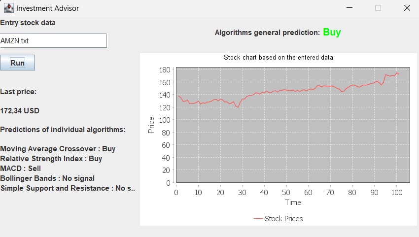

# Investment Advisor App 📊

An application that analyzes stock prices and provides predictions using various algorithms.
It allows users to input a text file with stock prices of a company from a given period, then generates a price chart and offers a general prediction on whether to buy, sell, or remain inactive.
The outputs of the app should not be considered as real investment advice 😊.

---

## 🛠 **Technologies Used**

- Java
- MVC Architecture
- Strategy Pattern
- Observer Pattern
- JFreeChart 

---

## 📸 **Screenshots**

---
